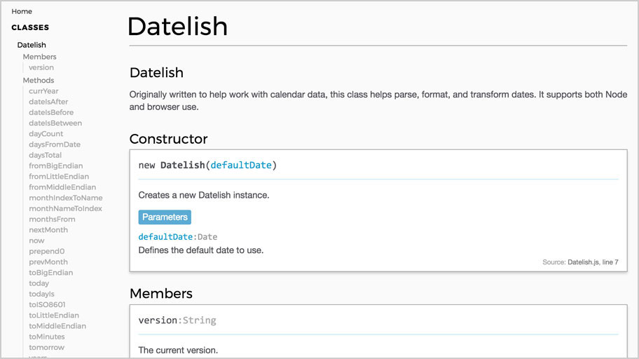
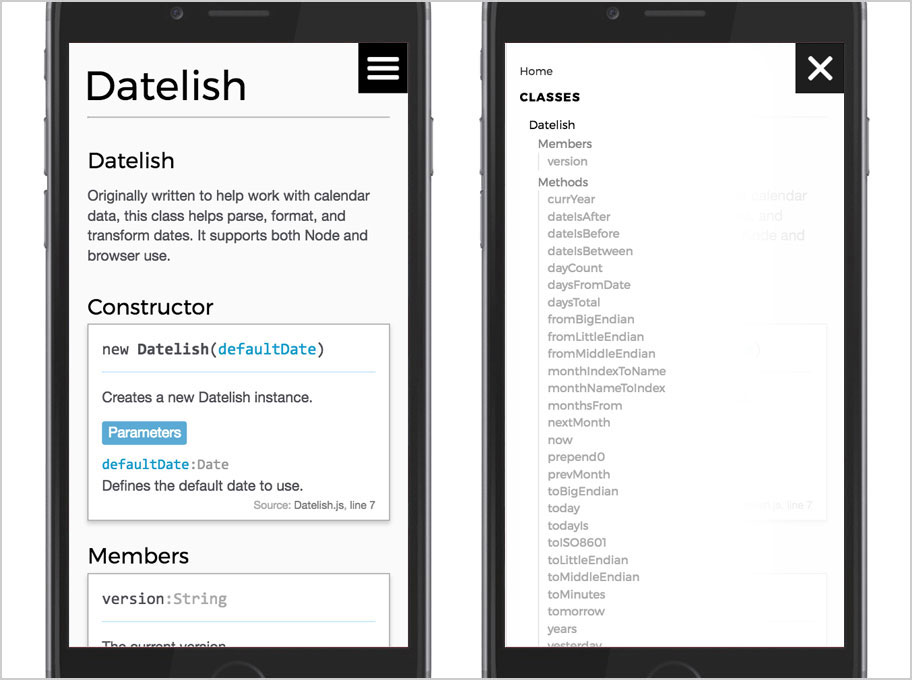

# Boxy JSDoc Template

A clean and streamlined JSDoc 3 template (extended from Minami).





See the template in action [here](http://grafluxe.com/o/doc/datelish/Datelish.html) and [here](http://grafluxe.com/o/doc/email-validator-pro/EmailValidatorPro.html).

## Extends

- [Minami](https://github.com/nijikokun/minami) JSDoc theme

## Uses

- The [Taffy Database library](http://taffydb.com/)
- [Montserrat](https://fonts.google.com/specimen/Montserrat) & Helvetica Neue

## Install

```
$ npm install --save-dev boxy-jsdoc-template
```

## Usage

Clone repository to your designated `jsdoc` template directory, then:

```
$ jsdoc entry-file.js -t path/to/boxy-jsdoc-template
```

### Via Node

`npm i boxy-jsdoc-template -D`

In your projects `package.json` file, add a generate script:

```
"script": {
  "doc": "jsdoc -c .jsdocrc"
}
```

In your `.jsdocrc` file, add a template option.

```
"opts": {
  "template": "node_modules/boxy-jsdoc-template"
}
```

### Example JSDoc Config

```
{
    "tags": {
        "allowUnknownTags": true,
        "dictionaries": ["jsdoc"]
    },
    "source": {
        "include": ["lib", "package.json", "README.md"],
        "includePattern": ".js$",
        "excludePattern": "(node_modules/|docs)"
    },
    "plugins": [
        "plugins/markdown"
    ],
    "templates": {
        "cleverLinks": false,
        "monospaceLinks": true,
        "useLongnameInNav": false
    },
    "opts": {
        "destination": "./docs/",
        "encoding": "utf8",
        "private": true,
        "recurse": true,
        "template": "./node_modules/boxy-jsdoc-template"
    }
}
```

Specifying a number for useLongnameInNav it will be the max number of path elements to show in nav (starting from Class).

## Thanks

Thanks to the author of the [Minami](https://github.com/nijikokun/minami) theme and its contributors. Their theme and README served as a great base to build from.

## License

Licensed under the Apache2 license.
